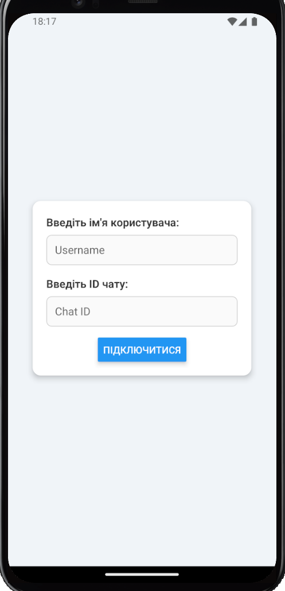
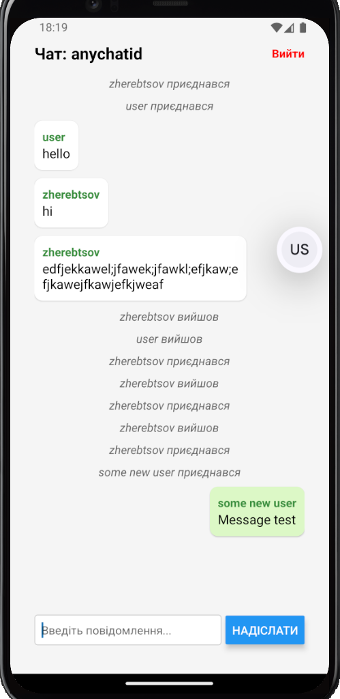

### 1. Встановлення залежностей
- **Node.js**
- **Expo CLI**
- Встановіть залежності через `npm install`

- **Java Development Kit (JDK)**: 
- 21.х.х версії
- Перевірте, що `JAVA_HOME` прописаний у змінних середовища

- **Android SDK**:
Встановлюється разом із Android Studio. Після встановлення:
- Перевірте, що `ANDROID_HOME` прописаний у змінних середовища

### 2. Запуск емулятора (опціонально)
- Відкрийте **Android Studio**.
- Увімкніть віртуальний пристрій у **Device Manager**.

### 3. Запуск додатку
У корені проєкту запустіть: `npx expo start`. Після ви можете відкрити додаток на власному телефону через Expo Go зчитавши QR код, або відкрити додаток на емуляторі клавішою А

### 4. Налаштування підключення до серверу
- Якщо запуск клієнту відбувається через емулятор Android Studio - додаткові дії не потрібні
- Для запуску через реальний фізичний пристрій - в `clientapp/pusher.json` потрібно змінити адресу `restServer`. І сервер, і телефон мають бути підключені до однієї мережі. Значення `restServer` буде локальною ip-адресою сервера, типово це - `http:192.168.0.1:4000`. Щоб дізнатись локальну ip-адресу, можна скористатись командою `ipconfig`.

### 5. Запуск серверу
- `node index.js`

## Демо відео:

## Скріншоти

