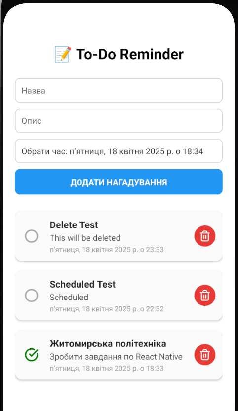
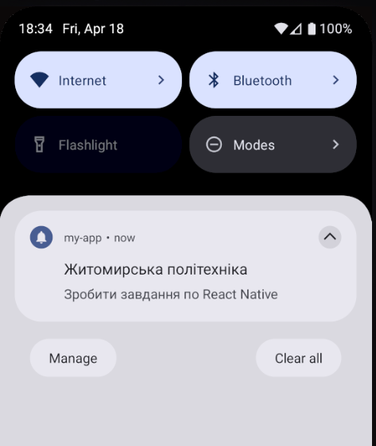
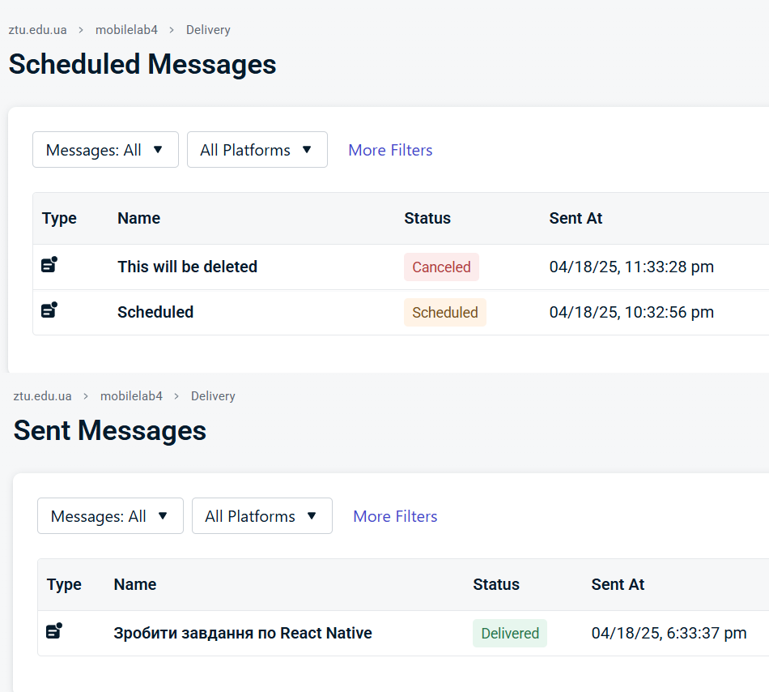

### 1. Встановлення залежностей

- **Node.js** та `npm`
- **Expo CLI**

- **Java Development Kit (JDK)**: 
- 21.х.х версії
- Перевірте, що `JAVA_HOME` прописаний у змінних середовища

- **Android SDK**:
Встановлюється разом із Android Studio. Після встановлення:
- Перевірте, що `ANDROID_HOME` прописаний у змінних середовища

### 3. Створення .env
- Використовуючи **exampleEnv**, створіть власний .env файл у корені проєкту

### 4. Запуск емулятора

- Відкрийте **Android Studio**.
- Увімкніть віртуальний пристрій у **Device Manager**.

### 5. Запуск додатку
У корені проєкту запустіть: `npx expo run:android`, це збере додаток і запустить його на емуляторі

